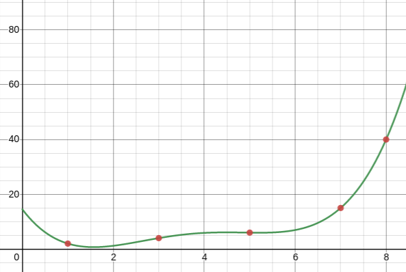

# Interpolador
<h1 align="center">
  <br>
  <a href="#"></a>
  <br>
  Interpolador
  <br>
</h1>

# Descrição
Este simples programa, através de um conjunto finito de pontos, retorna uma função (de forma numérica) pela interpolação. Os métodos utilizados para interpolação são:

- Newton com uso de Diferenças Divididas;
- Gregory-Newton com uso de Diferenças Finitas.

Espera-se que este código seja útil para quem está estudando Cálculo Numérico.

## Entendendo o código
O código pode ser utilizado para quem quer entender o método, ou até mesmo quem queira utilizá-lo como ferramenta. Para isso no método `main` há comentários que dividem o código principal em 5 partes. Abaixo há um exemplo de como foi feito:

```c++
// Parte 1 - Escolher o método
  do {
    cout<<"Escolha o método: \n1. Método de Newton com uso de Diferenças Divididas \n2. Método de Gregory-Newton com uso de Diferenças Finitas\nOpção: ";
    cin>>opcMetodo;
    cout<<endl;
  } while (opcMetodo!=1 && opcMetodo!=2);
```

Caso você queira somente usar como ferramenta, basta alterar os parâmetros da função `debug()` na _Parte 5_ do programa. A função espera como entrada 3 parâmetros `debug(inicio,fim,pontos)`, `inicio` e `fim` são valores de x no qual você quer obter o valor de _f(x)_ e `pontos` o número de pontos entre esse intervalo. 

```c++
debug(0,8,100);
```

O exemplo acima (o default) retorna um _debug_ com 100 pontos, entre 0 e 8.

```csv
------ DEBBUG PARA DESMOS ------
0;14.5
0.08;12.8174
0.16;11.2757

...

8.8;81.1025
8.88;86.5936
8.96;92.3718
-------- FIM DO DEBBUGER -------
```

Você pode copiar todos estes valores e colar  no [Desmos](https://www.desmos.com/calculator) podemos ver a função!

<center>



</center>

Para compilar e executar um programa destes, basta executar o comando com o nome de arquivo, com o terminal dentro da pasta `game`:

```g++ main.cpp && ./a.out```

> O comando acima precisa do compilador g++ instalado na máquina, se você não sabe o que é isso, comece lendo sobre [por aqui](https://pt.wikipedia.org/wiki/GNU_Compiler_Collection)

## Autores
- [Maurício Taffarel](https://github.com/taffarel55/)
- [Breno Amin](https://github.com/brenoamin)
- [Geraldo Júnior](https://github.com/GeraldinJr)

## Contribuindo
Contribuições são o que tornam a comunidade de código aberto um lugar incrível para aprender, inspirar e criar. Todas as contribuições que você fizer são muito bem vindas! 

Se quiser "fortalecer" aí, pode abrir o pull request!! :heart_eyes:

## Licença
[GPL-3.0 License ](https://github.com/taffarel55/Interpolador/blob/master/LICENSE)

<div>Ícones feitos por <a href="https://www.freepik.com" title="Freepik">Freepik</a> from <a href="https://www.flaticon.com/br/" title="Flaticon">www.flaticon.com</a></div>
